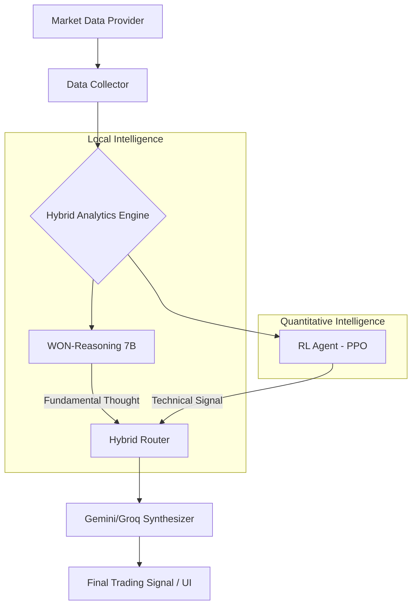

# 🚀 Trading Assistant Pro v2.5

**Hybrid AI Trading Platform - Local LLM Reasoning & RL Quantitative Agents**

[](https://fastapi.tiangolo.com/)
[](https://react.dev/)
[](https://huggingface.co/KRX-Data/WON-Reasoning)
[](https://huggingface.co/Adilbai/stock-trading-rl-agent)

---

## ⚡ Hybrid AI Architecture (V2.5 New!)

Trading Assistant Pro는 단순한 보조 지표를 넘어, **기본적 분석(Reasoning)**과 **기술적 분석(Reinforcement Learning)**을 결합한 하이브리드 지능을 탑재했습니다.

### 🧠 1. WON-Reasoning (Local Fundamental AI)
- **Local Power:** RTX 4070 Ti Super 등 로컬 GPU를 활용한 7B 파라미터 추론 모델 구동.
- **Deep Thought:** `<think>` 과정을 통해 기업 공시, 뉴스, 시장 수급을 한국 전문가의 시각에서 심층 분석.
- **Privacy:** 민감한 투자 논리를 외부 유출 없이 로컬에서 안전하게 처리.

### 🤖 2. RL Trading Agent (Quantitative Technical AI)
- **PPO Algorithm:** Proximal Policy Optimization 기반의 강화학습 에이전트.
- **High-Dim Input:** 60일간의 차트 시퀀스와 포트폴리오 상태 등 **3008차원** 데이터를 실시간 연산.
- **Tactical Signals:** BUY / SELL / HOLD 신호뿐만 아니라 최적의 **Position Size(비중)**까지 산출.

### 🔗 3. Smart Synthesis Layer
- **Unified Insight:** WON-Reasoning의 기본적 통찰과 RL의 기술적 데이터를 Gemini 2.0/Groq가 최종 합성하여 최적의 매매 가이드를 제안.

---

## ✨ 핵심 기능

- **📈 실시간 차트 & 30+ 패턴 감지:** TradingView 기술 기반의 고성능 차트와 자동 패턴 인식.
- **🌐 통합 시장 분석:** 한국 시장(.KS/.KQ)과 미국 시장(S&P 500, NASDAQ) 동시 지원.
- **📅 경제/실적 캘린더:** 주요 거시 지표 및 기업 실적 발표 일정 자동 동기화.
- **💼 AI 포트폴리오 진단:** 현재 보유 종목의 리스크와 섹터 분산도 자동 리밸런싱 제안.
- **📱 Modern Glassmorphism UI:** 고도화된 시각화와 애니메이션을 통한 프리미먼 트레이딩 경험.

---

## 🏗️ 시스템 아키텍처



---

## 🛠️ 기술 스택

### **Backend (Python)**
- **FastAPI / Uvicorn:** 고성능 비동기 API 서버.
- **Transformers / BitsAndBytes:** 4-bit 양자화 기반 로컬 LLM 구동.
- **Stable-Baselines3 / Gymnasium:** 강화학습 모델 추론 및 리서치.
- **MarketDataCollector:** 다중 소스(yfinance, KIS) 데이터 파이프라인.

### **Frontend (React)**
- **Vite / TypeScript:** 빠르고 안정적인 개발 환경.
- **Framer Motion:** 부드러운 UI 전환 및 마이크로 애니메이션.
- **Lightweight Charts:** 고성능 캔버스 기반 차트 렌더링.

---

## 📊 API 엔드포인트 (v2.5)

### **하이브리드 분석**
- `POST /api/analysis/kr/hybrid` - LLM + RL + Synthesis 통합 리포트 생성.

### **AI 트레이딩 신호**
- `GET /api/trading/signals/rl/{ticker}` - RL 에이전트 기반 기술적 매매 신호 조회.

### **기본 분석**
- `GET /analyze/{ticker}` - 전통적 기술 지표 기반 종합 분석.
- `GET /history/{ticker}` - 시세 데이터 및 차트 이력 기반 데이터.

---

## 🚀 시작하기

### 📦 1. 저장소 클론 및 의존성 설치
```bash
git clone https://github.com/your-repo/trading-assistant-pro.git
cd trading-assistant-pro

# 가상환경 구축 및 패키지 설치
python -m venv .venv
source .venv/bin/activate  # Windows: .venv\Scripts\activate
pip install -r requirements.txt
```

### ⚙️ 2. 환경 변수 설정 (.env)
```env
GEMINI_API_KEY="your_google_ai_key"
GROQ_API_KEY="your_groq_key"
HF_TOKEN="your_huggingface_token"
```

### 🏃 3. 서버 실행
```bash
# 통합 실행 (추천)
python -m uvicorn src.api.server:app --host 0.0.0.0 --port 8000
```

---

## 🤝 기여 및 문의
- **Issues:** 버그 리포트 및 기능 제안은 GitHub Issues를 이용해 주세요.
- **Made with ❤️ by Antigravity AI Team**

---
*면책 조항: 이 소프트웨어는 투자 참고용이며, 모든 투자 결정에 대한 책임은 투자 본인에게 있습니다.*
